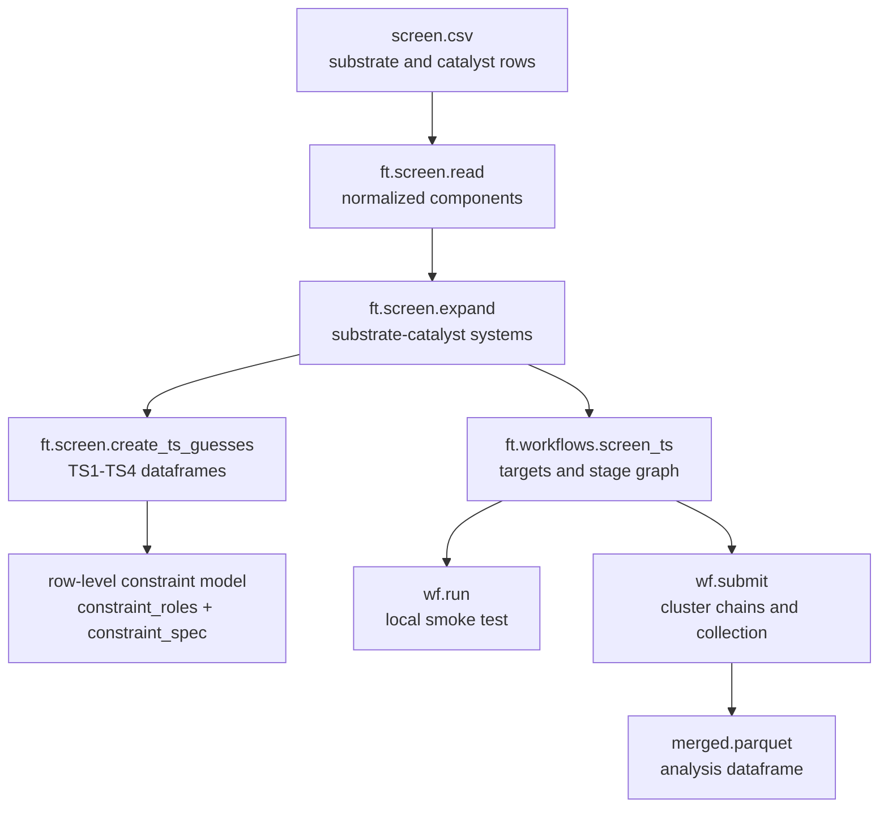

# Catalyst Screen Workflow

A catalyst screen starts from one component table and expands it into explicit
transition-state candidates.

```csv
role,smiles,compound_name,rpos,series
substrate,CN1C=CC=C1,n_methyl_pyrrole,,pyrrole
substrate,COC1=CC=CO1,methoxyfuran,"3,5",furan
catalyst,CC1(C)CCCC(C)(C)N1C2=CC=CC=C2B,tmp_bcat,,baseline
```

```python
import frust as ft

components = ft.screen.read("screen.csv")
systems = ft.screen.expand(components)
ts_guesses = ft.screen.create_ts_guesses(
    systems,
    ts_types=["TS1", "TS2", "TS3", "TS4"],
    n_confs=1,
)
```

The dataframe path is:

```text
component rows
    -> substrate-catalyst systems
    -> one row per TS type, system, reactive position, and conformer
    -> row-level constrained xTB/DFT calculations
    -> ranked and collected result dataframe
```

The production path uses the same chemistry through a workflow object:

```python
method = ft.workflows.methods.preset("r2scan-3c")

wf = ft.workflows.screen_ts(
    csv_path="screen.csv",
    ts_types=["TS1", "TS2", "TS3", "TS4"],
    method=method,
    n_confs=None,
    top_n=10,
    dft=True,
)

df = wf.run(targets=[0], out_dir="debug/screen_ts", execution="dft_staged")
```

## What This Workflow Can Do

| Capability | Public entry point | Output |
| --- | --- | --- |
| Normalize a mixed substrate/catalyst CSV | `ft.screen.read(...)` | Component dataframe with canonical `role`, `smiles`, `compound_name`, and `rpos` columns |
| Cross substrates and catalysts | `ft.screen.expand(...)` | One system row per substrate-catalyst pair |
| Auto-select substrate positions | blank substrate `rpos` | Symmetry-unique aromatic C-H positions |
| Generate built-in TS motifs | `ft.screen.create_ts_guesses(...)` | Separate dataframes for `TS1`, `TS2`, `TS3`, and `TS4` |
| Carry optimizer constraints per row | generated `constraint_roles` and `constraint_spec` | `Stepper(..., constraint=True)` can render constraints without fixed atom indices |
| Inspect generated cores | `ts_core_metrics`, `ft.plot_row(...)`, `ft.plot_mols(...)` | Template distances/angles and visual geometry checks |
| Run local smoke tests | `wf.run(targets=[0], ...)` | Same target and method graph used for cluster submission |
| Submit staged production jobs | `wf.submit(...)` | Target directories, staged parquet files, merged output, and collection report |

!!! info "The screen does not discover arbitrary mechanisms"

    FRUST instantiates built-in transition-state motifs for related
    substrate/catalyst chemistry. It does not infer a full reaction mechanism
    from arbitrary SMILES.

## How The Pieces Fit



`frust.screen` owns the user-facing component table. `frust.tsguess` owns TS
construction. `ft.workflows.screen_ts(...)` combines both with method plans,
local execution, cluster submission, and collection.

## Choosing An Entry Point

| You want to... | Use |
| --- | --- |
| Check the CSV normalization and generated systems | `ft.screen.read(...)` and `ft.screen.expand(...)` |
| Generate TS guesses for plotting or custom `Stepper` work | `ft.screen.create_ts_guesses(...)` |
| Run a production screen that can move from laptop to Slurm | `ft.workflows.screen_ts(...)` |
| Use the older one-call local helper | `ft.pipes.run_screen_ts_per_rpos(...)` |
| Use the older staged cluster helper directly | `ft.cluster.submit_screen_chain(...)` |

For new work, prefer `ft.workflows.screen_ts(...)`. It keeps the chemistry,
method plan, target list, execution mode, and collector in one object.

## Current Scope

Supported now:

| Area | Supported behavior |
| --- | --- |
| Catalysts | Neutral B-aryl-N catalysts with exactly one recognizable scaffold |
| Substrates | Aromatic C-H reactive positions selected by `rpos` or symmetry-unique detection |
| TS families | Built-in `TS1`, `TS2`, `TS3`, and `TS4` methylpyrrole/TMP-derived motifs |
| Constraints | Row-level distance and angle constraints rendered from `constraint_spec` |
| Execution | xTB/ORCA stages through `Stepper`, workflow objects, and cluster submission |

Not automatic yet:

| Area | Current limitation |
| --- | --- |
| Catalyst topology | Arbitrary catalyst scaffolds are not matched |
| Reactive site class | Non-aromatic C-H activation sites are not generated |
| Template calibration | Optimized TS structures are not yet used to recalibrate templates automatically |
| Mechanism search | FRUST does not choose a mechanism from SMILES alone |

## Read Next

- [Input Tables](input-tables.md): CSV format, `rpos`, metadata, and system expansion.
- [TS Guess Dataframes](ts-guesses.md): TS1-TS4 roles, constraints, core metrics, and geometry checks.
- [Running Screens](running.md): local smoke tests, cluster submission, outputs, and inspection.
