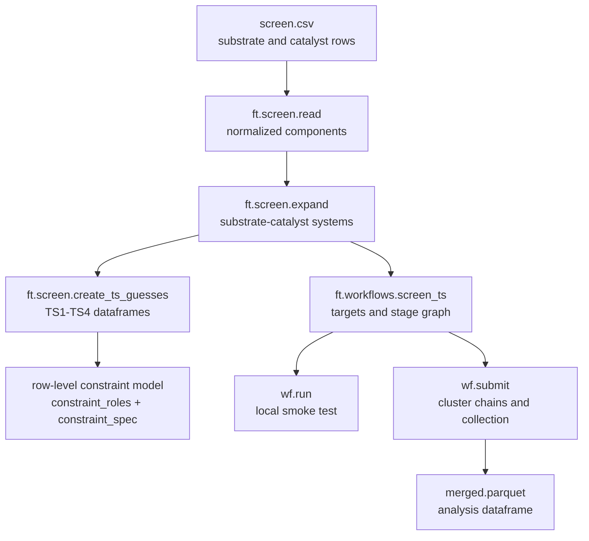

# Catalyst Screen Workflow

A catalyst screen starts from one component table and expands it into explicit
transition-state candidates.

```csv
role,smiles,compound_name,rpos,series
substrate,CN1C=CC=C1,n_methyl_pyrrole,,pyrrole
substrate,COC1=CC=CO1,methoxyfuran,"3,5",furan
catalyst,CC1(C)CCCC(C)(C)N1C2=CC=CC=C2B,tmp_bcat,,baseline
```

```python
import frust as ft

components = ft.screen.read("docs/examples/screen.csv")
systems = ft.screen.expand(components)
ts_guesses = ft.screen.create_ts_guesses(
    systems,
    ts_types=["TS1", "TS2", "TS3", "TS4"],
    n_confs=1,
)
```

The dataframe path is:

```text
component rows
    -> substrate-catalyst systems
    -> one row per TS type, system, reactive position, and conformer
    -> row-level constrained xTB/DFT calculations
    -> ranked and collected result dataframe
```

The production path uses the same chemistry through a workflow object:

```python
method = ft.workflows.methods.preset("r2scan-3c")

wf = ft.workflows.screen_ts(
    csv_path="docs/examples/screen.csv",
    ts_types=["TS1", "TS2", "TS3", "TS4"],
    method=method,
    n_confs=None,
    top_n=20,
    dft=True,
)

df = wf.run(targets=[0], out_dir="debug/screen_ts", execution="dft_staged")
```

The workflow prunes redundant initial conformers by default before the first
xTB stage. Direct `ft.screen.create_ts_guesses(...)` calls only generate the TS
guess dataframes; prune those manually with `ft.prune_conformers(...)` or
`Stepper.prune_conformers(...)` when needed.

## What This Workflow Can Do

| Capability | Public entry point | Output |
| --- | --- | --- |
| Normalize a mixed substrate/catalyst CSV | `ft.screen.read(...)` | Component dataframe with canonical `role`, `smiles`, `compound_name`, and `rpos` columns |
| Cross substrates and catalysts | `ft.screen.expand(...)` | One system row per substrate-catalyst pair |
| Auto-select substrate positions | blank substrate `rpos` | Symmetry-unique aromatic C-H positions |
| Generate built-in TS motifs | `ft.screen.create_ts_guesses(...)` | Separate dataframes for `TS1`, `TS2`, `TS3`, and `TS4` |
| Prune redundant initial conformers | default `ft.workflows.screen_ts(...)` stage or `ft.prune_conformers(...)` | Fewer geometrically similar rows before xTB/DFT stages |
| Carry optimizer constraints per row | generated `constraint_roles` and `constraint_spec` | `Stepper(..., constraint=True)` can render constraints without fixed atom indices |
| Inspect generated cores | `ts_core_metrics`, `ft.plot_row(...)`, `ft.plot_mols(...)` | Template distances/angles and visual geometry checks |
| Run local smoke tests | `wf.run(targets=[0], ...)` | Same target and method graph used for cluster submission |
| Submit staged production jobs | `wf.submit(...)` | Target final parquets, `timing.json` files, merged output, and collection report |

!!! info "The screen does not discover arbitrary mechanisms"

    FRUST instantiates built-in transition-state motifs for related
    substrate/catalyst chemistry. It does not infer a full reaction mechanism
    from arbitrary SMILES.

## How The Pieces Fit


```mermaid
flowchart TD
    A["screen.csv<br/>substrate and catalyst rows"]
    B["ft.screen.read<br/>normalized components"]
    C["ft.screen.expand<br/>substrate-catalyst systems"]
    D["ft.screen.create_ts_guesses<br/>TS1-TS4 dataframes"]
    E["row-level constraint model<br/>constraint_roles + constraint_spec"]
    F["ft.workflows.screen_ts<br/>targets and stage graph"]
    G["wf.run<br/>local smoke test"]
    H["wf.submit<br/>cluster chains and collection"]
    I["merged.parquet<br/>analysis dataframe"]

    A --> B --> C --> D --> E
    C --> F
    F --> G
    F --> H --> I
```

`frust.screen` owns the user-facing component table and selects the configured
TS backend. The production default is `tsguess2`, which builds connected
TS-like graphs and v2 role-coordinate maps. `ft.workflows.screen_ts(...)`
combines that chemistry with method plans, local execution, cluster submission,
and collection.

## Choosing An Entry Point

| You want to... | Use |
| --- | --- |
| Check the CSV normalization and generated systems | `ft.screen.read(...)` and `ft.screen.expand(...)` |
| Generate TS guesses for plotting or custom `Stepper` work | `ft.screen.create_ts_guesses(...)` |
| Run a production screen that can move from laptop to Slurm | `ft.workflows.screen_ts(...)` |
| Use the older one-call local helper | `ft.pipes.run_screen_ts_per_rpos(...)` |
| Use the older staged cluster helper directly | `ft.cluster.submit_screen_chain(...)` |

For new work, prefer `ft.workflows.screen_ts(...)`. It keeps the chemistry,
method plan, target list, execution mode, and collector in one object.

## Current Scope

Supported now:

| Area | Supported behavior |
| --- | --- |
| Catalysts | Catalysts with a supported boron center; TS1/TS2 additionally require the current tertiary-amine motif |
| Substrates | Aromatic C-H reactive positions selected by `rpos` or symmetry-unique detection |
| TS families | Built-in `tsguess2` TS1-TS4 connected-graph specifications with versioned v2 role coordinates |
| Constraints | Row-level distance and angle constraints rendered from `constraint_spec` |
| Execution | xTB/ORCA stages through `Stepper`, workflow objects, and cluster submission |

Not automatic yet:

| Area | Current limitation |
| --- | --- |
| Catalyst topology | Arbitrary boron/amine topologies are not generated; unsupported graphs fail during building or role matching |
| Reactive site class | Non-aromatic C-H activation sites are not generated |
| Template calibration | Optimized TS structures are not yet used to recalibrate templates automatically |
| Mechanism search | FRUST does not choose a mechanism from SMILES alone |

## Read Next

- [Input Tables](input-tables.md): CSV format, `rpos`, metadata, and system expansion.
- [TS Guess DataFrames](ts-guesses.md): the default `tsguess2` graph, roles, constraints, core metrics, and geometry checks.
- [Running Screens](running.md): local smoke tests, cluster submission, outputs, and inspection.
