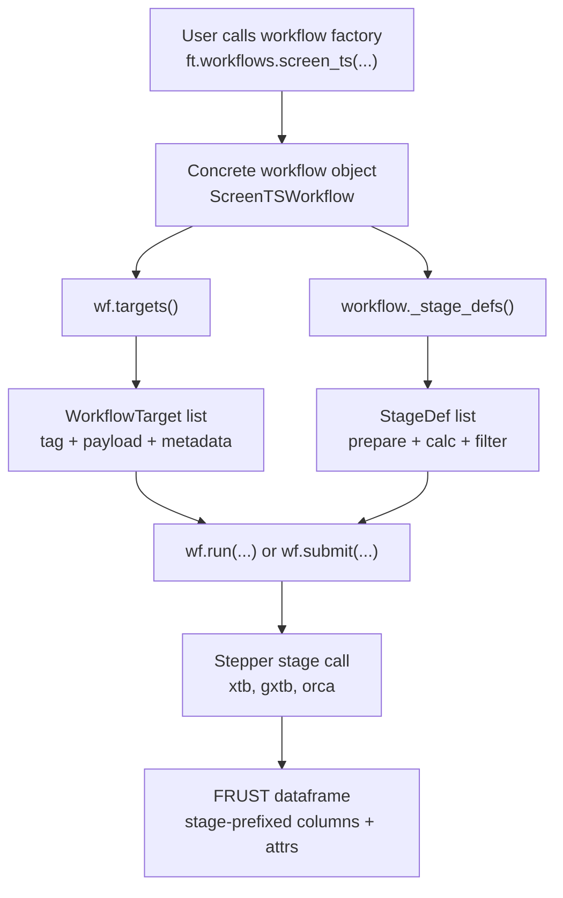
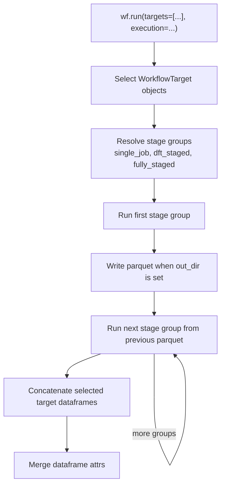
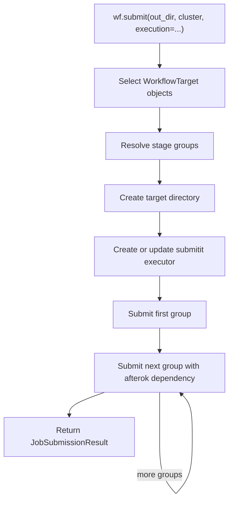
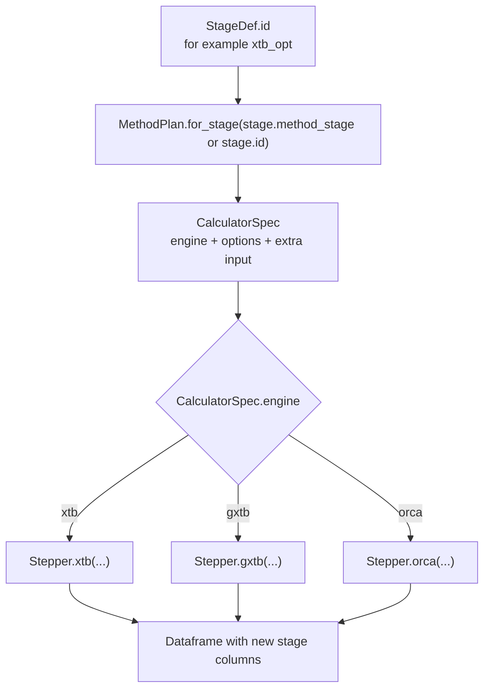

# Workflow Architecture

This page is for developers maintaining `frust.workflows`. User-facing pages
show how to run workflows. This page explains how the workflow module is built,
where code should go, and which invariants should not be broken.

## Start With The Code Shape

```text
frust/workflows/
  methods.py    -> calculator plans
  factories.py  -> concrete chemistry workflows
  core.py       -> local/cluster execution engine
```

The important design choice is separation of responsibility:

| Code area | Owns | Does not own |
| --- | --- | --- |
| `methods.py` | calculator engines, options, and method presets | chemistry target expansion |
| `factories.py` | chemistry-specific workflow classes and target preparation | submitit dependency wiring |
| `core.py` | shared target selection, local execution, cluster submission, collection | catalyst/substrate chemistry |

This keeps method changes, chemistry changes, and execution changes from
silently affecting each other.

## Main Objects

| Object | File | Maintainer responsibility |
| --- | --- | --- |
| `CalculatorSpec` | `methods.py` | one engine/options block |
| `MethodPlan` | `methods.py` | stage-id to calculator mapping |
| `WorkflowTarget` | `core.py` | one scientific unit of work |
| `StageDef` | `core.py` | one workflow stage |
| `BaseWorkflow` | `core.py` | shared target/run/submit/collect behavior |
| `MolsWorkflow`, `ScreenTSWorkflow`, `LegacyTSWorkflow` | `factories.py` | chemistry-specific target building and preparation |

The key mental model is:

```text
WorkflowTarget = what chemical target should be processed
StageDef       = what stage should happen next
MethodPlan     = which calculator settings are used for that stage
BaseWorkflow   = how targets and stages become local calls or cluster jobs
```

## End-To-End Flow



`targets()` is inspection and scheduling preparation. It must not run
calculators and should avoid expensive embedding. The first expensive chemistry
construction step belongs in `_prepare_initial_df(...)`, which runs inside
`wf.run(...)` or inside the submitted cluster job.

## Local Execution Flow



Local staged execution deliberately mirrors cluster output. When `out_dir` is
provided, each target gets its own directory. During execution, staged parquet
checkpoints are written as each group finishes:

```text
TS1__furan__TMP__r0/
  ts_guess.parquet
  init.parquet
  init.hess.parquet
  init.hess.optts.parquet
  init.hess.optts.freq.parquet
  init.hess.optts.freq.solv.parquet
```

After a successful target finishes, workflow objects compact the directory by
default to the final parquet plus `timing.json`. Pass
`target_retention="all"` to keep every checkpoint for successful targets.
Failed or interrupted targets keep their intermediate files.

## Cluster Submission Flow



For Slurm, dependencies are attached through
`update_executor_with_dependency(...)`. The workflow object itself is
serialized into each submitted job together with the target, selected stage
ids, input parquet name, output parquet name, save directory, and execution
options.

!!! note "Local and cluster parity"

    `run(...)` and `submit(...)` must use the same `WorkflowTarget` objects and
    `StageDef` lists. A stage-order change should affect local and cluster
    execution in the same way.

## Calculator Dispatch



`StageDef.id` is the stable method-plan key. `StageDef.name` is the calculation
name used by `Stepper`, so it becomes the dataframe column prefix. For example,
stage id `optts` can run with calculation name `OptTS`, producing columns such
as `OptTS-EE`, `OptTS-NT`, and `OptTS-oc`.

Use `StageDef.method_stage` only when the stage should reuse a different
method-plan key. Otherwise the method key is `StageDef.id`.

## Execution Modes

| mode | Stage grouping | Typical use |
| --- | --- | --- |
| `single_job` | all stages in one group | small tests or non-DFT workflows |
| `dft_staged` | initialization group, then DFT stages split out | normal production DFT |
| `fully_staged` | one group per stage | debugging or unusual resource tuning |

`BaseWorkflow._stage_groups(...)` owns this grouping. Avoid adding a new
execution mode unless a real scheduling pattern cannot be represented by these
three modes.

## Extension Playbooks

### Add A New Method Preset

Add a new `MethodPlan` builder in `methods.py`, then register it in
`_ensure_builtin_presets()`.

```python
def _my_method() -> MethodPlan:
    return MethodPlan(
        name="my-method",
        stages=_base_stages(
            dft_pre_sp=orca(method="...", basis="...", job="sp"),
            dft_pre_opt=orca(method="...", basis="...", job="opt"),
            dft_opt=orca(method="...", basis="...", job="opt"),
            hess=orca(method="...", basis="...", job="freq"),
            optts=orca(method="...", basis="...", job="optts"),
            freq=orca(method="...", basis="...", job="freq"),
            solv=orca(method="...", basis="...", job="sp", solvent="chloroform"),
        ),
    )
```

Test the stage options directly. For composite ORCA methods such as
`r2SCAN-3c`, assert that no separate basis keyword appears.

### Replace A Calculator Stage

Use `MethodPlan.replace(...)` for user-facing examples and tests:

```python
method = (
    methods.preset("r2scan-3c")
    .replace(
        xtb_sp=methods.gxtb(job="sp"),
        xtb_opt=methods.gxtb(job="opt"),
    )
)
```

If a new engine is needed, add it to `CalculatorSpec.__post_init__` and update
the dispatch logic in `core.py`. Also add tests that prove the correct
`Stepper` method is called.

### Add A New Workflow Factory

Create a `BaseWorkflow` subclass in `factories.py` and implement:

| Method | Must do |
| --- | --- |
| `_build_targets()` | return lightweight `WorkflowTarget` objects |
| `_prepare_initial_df(...)` | create the first dataframe for one target |
| `_step_type_for_target(...)` | return the `Stepper` step type when needed |
| `_stage_defs()` | return the stage graph for this workflow |

Expose the factory through `frust.workflows.__init__`, not as a direct
top-level `ft.<name>` alias.

Add tests for:

- target tags and metadata;
- local execution with mocked `Stepper`;
- cluster submission with a fake executor;
- public namespace discoverability.

### Add A New Stage

Use a stable `StageDef.id`. Ensure the active `MethodPlan` has a matching stage
key, or set `method_stage` explicitly.

When changing stage order or parquet names, update tests that assert:

- staged local output filenames;
- cluster dependency graph and resource-key behavior;
- final `wf.collect(...)` behavior;
- `ft.show_steps(...)` metadata remains useful.

## Important Invariants

- `targets()` must not run expensive embedding or calculators.
- `run(...)` and `submit(...)` must use the same target and stage definitions.
- `MethodPlan` changes calculators, not chemistry or target expansion.
- `StageDef.id` is the stable internal key; `StageDef.name` is the dataframe
  output/calculation name.
- Dataframe provenance belongs in `df.attrs`, not sparse stage-specific
  columns.
- Existing `pipes.py`, `Stepper`, `submit_chain(...)`, and
  `submit_screen_chain(...)` remain supported lower layers.

## Test Map

| Behavior | Tests |
| --- | --- |
| method presets and stage replacement | `tests/test_workflow_methods.py` |
| target expansion and staged local output | `tests/test_workflows.py` |
| cluster dependency wiring | `tests/test_workflows.py` |
| namespace discoverability | `tests/test_public_api.py` |

Targeted checks:

```bash
conda run -n UMA pytest tests/test_workflow_methods.py tests/test_workflows.py tests/test_public_api.py -q
conda run -n UMA mkdocs build --strict
```
