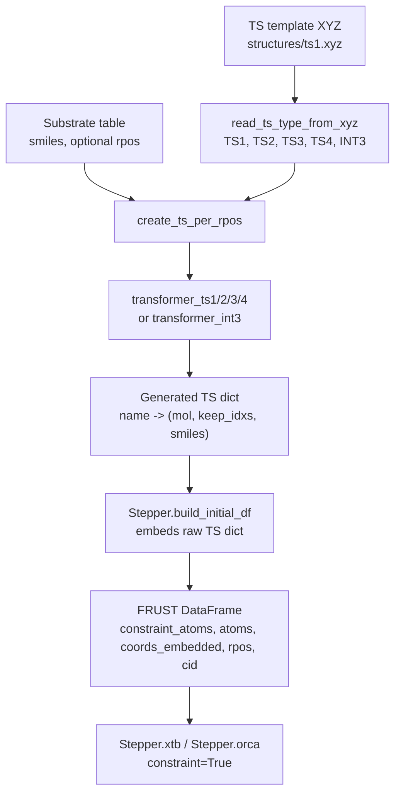
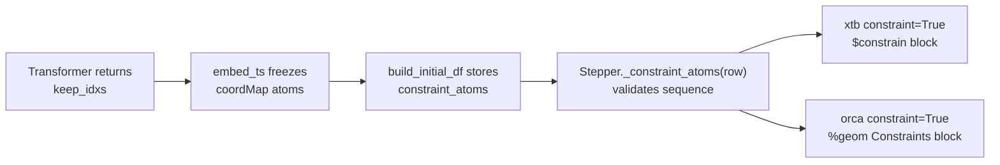

# Templates

This tutorial explains the FRUST templating protocol from the point of view of
someone reading or modifying the code. A template workflow starts with a
transition-state-like `.xyz` file and a table of substrates, then turns those
inputs into embedded structures, DataFrame rows, and constrained xTB or ORCA
jobs.

!!! warning "Template geometry is chemical input"

    A template is not just a convenient starting geometry. Its comment line,
    atom order, connectivity, and reactive-core atom positions are part of the
    protocol. If those change, the transformer and constraint assumptions may no
    longer match the intended chemistry.

## The Big Picture



The main code path is:

```python
from frust.utils.io import read_ts_type_from_xyz
from frust.utils.mols import create_ts_per_rpos
from frust.stepper import Stepper
```

The high-level workflow functions call the same pieces for you, but the
lower-level functions are useful when you need to understand or debug a new
template.

## Start With A Substrate Table

The input table must contain a `smiles` column. The optional `rpos` column tells
FRUST which aromatic C-H positions to use.

```python
import pandas as pd

ligands = pd.DataFrame(
    {
        "smiles": ["CN1C=CC=C1"],
        "rpos": ["2"],
    }
)

ligands
```

Output:

|  | smiles | rpos |
| ---: | --- | --- |
| 0 | `CN1C=CC=C1` | `2` |

This is the smallest useful substrate table: one substrate and one requested
reactive position. For larger screens, each row can point to a different
substrate, and `rpos` can contain several positions such as `"2;3"`.

Reactive-position rules:

- If `rpos` is missing, FRUST finds symmetry-unique aromatic C-H positions.
- If `rpos` is present, FRUST validates each value against the valid aromatic
  C-H atoms for that SMILES.
- Multiple positions are written as a semicolon-separated string, for example
  `"2;3"`.

!!! tip "Inspect valid positions before generating templates"

    Use the visualization helper when you are uncertain about atom numbering:

    ```python
    from frust.vis import DrawUniqueChGrid

    DrawUniqueChGrid(ligands, smiles_col="smiles")
    ```

## Read The Template Type

The template type is read from the second line of the `.xyz` file. The comment
must contain a token such as `TS1`, `TS2`, `TS3`, `TS4`, or `INT3`.

```python
from frust.utils.io import read_ts_type_from_xyz

ts_type = read_ts_type_from_xyz("structures/ts1.xyz")
print(ts_type)  # "TS1"
```

Output:

```text
TS1
```

Internally, `create_ts_per_rpos(...)` uses this value to dispatch to the matching
transformer:

| Template type | Transformer |
| --- | --- |
| `TS1` | `frust.transformers.transformer_ts1` |
| `TS2` | `frust.transformers.transformer_ts2` |
| `TS3` | `frust.transformers.transformer_ts3` |
| `TS4` | `frust.transformers.transformer_ts4` |
| `INT3` | `frust.transformers.transformer_int3` |

!!! warning "Template atom order matters"

    The transformers contain template-specific assumptions. They identify an
    active-site substructure, align the incoming substrate onto it, remove
    template-specific bonds, and return a list of reactive-core atom indices.
    The later constraint blocks interpret those indices by position, so changing
    template atom order can silently change what gets constrained.

## Expand The Template Over Reactive Positions

Use `create_ts_per_rpos(...)` to combine the substrate table with the `.xyz`
template.

```python
from frust.utils.mols import create_ts_per_rpos

ts_structs = create_ts_per_rpos(
    ligands,
    ts_guess_xyz="structures/ts1.xyz",
    return_format="dict",
)

print(len(ts_structs))
print(next(iter(ts_structs)))
```

Representative output:

```text
1
TS1(1-methylpyrrole_rpos(2))
```

The key contains both the template type and the reactive position used to make
that generated structure.

Each dictionary entry is generated by the selected transformer. The value is the
structure tuple used by the embedder:

```python
name, value = next(iter(ts_structs.items()))
mol, keep_idxs, smiles = value

print(name)
print(smiles)
print(keep_idxs)
```

Representative output:

```text
TS1(1-methylpyrrole_rpos(2))
CN1C=CC=C1
[10, 11, 39, 40, 41, 44]
```

`keep_idxs` is the important bridge between templating and constraints. It is a
list of atom indices for the reactive core that should be preserved during
embedding and later constrained during selected optimization stages.

In table form, the generated object is easiest to reason about like this:

| Generated key | SMILES | Atoms in generated mol | `keep_idxs` |
| --- | --- | ---: | --- |
| `TS1(1-methylpyrrole_rpos(2))` | `CN1C=CC=C1` | 54 | `[10, 11, 39, 40, 41, 44]` |

!!! example "Inspect generated template structures"

    ```python
    from frust.vis import MolTo3DGrid

    MolTo3DGrid(
        [value[0] for value in ts_structs.values()],
        legends=list(ts_structs),
        highlightAtoms=[value[1] for value in ts_structs.values()],
        show_labels=True,
    )
    ```

## Build The Initial DataFrame

`Stepper.build_initial_df(...)` accepts the raw TS dictionary from
`create_ts_per_rpos(...)`. It embeds conformers and turns the result into a
normal FRUST dataframe. During embedding, `keep_idxs` becomes a coordinate map
(`coordMap`) so RDKit keeps the template reactive core close to the template
geometry.

```python
from frust.stepper import Stepper

step = Stepper(
    step_type="auto",
    n_cores=4,
    memory_gb=20,
    debug=True,
)

df = step.build_initial_df(ts_structs, n_confs=1, ts_optimize=False)
df[
    [
        "custom_name",
        "structure_type",
        "rpos",
        "cid",
        "constraint_atoms",
        "atoms",
        "coords_embedded",
    ]
].head()
```

`step_type="auto"` infers the constrained template type from the generated
structure names. In this example the dataframe contains only `TS1` rows, so
later `constraint=True` calls use the `TS1` constraint template.

Representative output:

|  | `custom_name` | `structure_type` | `rpos` | `cid` | `constraint_atoms` | `atoms` | `coords_embedded` |
| ---: | --- | --- | ---: | ---: | --- | --- | --- |
| 0 | `TS1(1-methylpyrrole_rpos(2))` | `TS1` | 2 | 0 | `[10, 11, 39, 40, 41, 44]` | `["C", "N", "C", ...]` | `54 x 3 coordinates` |

This is the point where the transformer output becomes normal FRUST table
metadata. From here on, calculation stages do not need the original `ts_structs`
dictionary; they read `constraint_atoms` from the DataFrame row.

!!! example "Inspect constraint atoms"

    ```python
    for _, row in df.iterrows():
        print(row["custom_name"])
        print("constraint_atoms:", row["constraint_atoms"])
    ```

    Expected output:

    ```text
    TS1(1-methylpyrrole_rpos(2))
    constraint_atoms: [10, 11, 39, 40, 41, 44]
    ```

The key columns created by `Stepper.build_initial_df(...)` are:

| Column | Meaning |
| --- | --- |
| `custom_name` | Generated structure name, usually containing `TS..._rpos(...)` |
| `structure_type` | Parsed type such as `TS1`, `TS2`, `TS3`, `TS4`, or `INT3` |
| `rpos` | Reactive position used for the generated structure |
| `cid` | RDKit conformer id |
| `constraint_atoms` | The `keep_idxs` list from the transformer |
| `atoms` | Element symbols for the conformer |
| `coords_embedded` | Starting coordinates for calculation stages |

!!! tip "Start with one conformer"

    When developing or checking a new template, use `n_confs=1`, `debug=True`,
    and a tiny substrate table. First confirm generated structures and
    `constraint_atoms`, then increase conformer coverage.

## How Constraints Flow Into Calculations



`constraint=True` is opt-in for calculation stages. The stepper first validates
that it has enough information:

- `Stepper(step_type=...)` must be set to `TS1`, `TS2`, `TS3`, `TS4`, `INT3`,
  or `"auto"` when the dataframe contains one constrained structure type.
- The DataFrame must contain `constraint_atoms`.
- Each row must contain a sequence of atom indices.

Then the backend-specific builder inserts a constraint block.

```python
df = step.xtb(
    df,
    name="xtb_preopt",
    options={"gfnff": None, "opt": None},
    constraint=True,
)
```

Conceptually, the xTB input receives a constraint section derived from the row's
`constraint_atoms`:

```text
$constrain
  atoms: 11,12,40,41,42,45
$end
```

The numbers above are one-based because the xTB writer adds `+1` to the stored
zero-based FRUST indices.

For ORCA, the same DataFrame column is used:

```python
df = step.orca(
    df,
    name="DFT-pre-Opt",
    options={
        "wB97X-D3": None,
        "6-31G**": None,
        "TightSCF": None,
        "Opt": None,
        "NoSym": None,
    },
    constraint=True,
    lowest=1,
)
```

The ORCA input follows the same idea but writes ORCA `%geom Constraints` syntax.
The exact block depends on the `step_type` because each TS or intermediate type
has a different constraint pattern.

!!! note "xTB uses one-based indices"

    In the current implementation, xTB constraint blocks convert
    `constraint_atoms` with `x + 1` before writing `$constrain`. ORCA constraint
    blocks use the stored indices as implemented in `Stepper.orca(...)`. This is
    why the generated `constraint_atoms` list should be treated as internal
    FRUST metadata rather than manually edited input.

## High-Level Entry Points

Most users call the higher-level workflow functions. They still follow the same
template protocol internally.

```python
from frust.pipes import run_ts_per_lig

df = run_ts_per_lig(
    ligands,
    ts_guess_xyz="structures/ts1.xyz",
    n_confs=1,
    debug=True,
    DFT=False,
)
```

`run_ts_per_lig(...)` expands the substrate table with
`create_ts_per_rpos(...)`, embeds every generated TS structure, builds the
initial DataFrame, and runs the xTB screening steps.

Use `run_ts_per_rpos(...)` when you already have one pre-expanded structure,
for example when a cluster workflow has split each reactive position into a
separate job.

```python
from frust.pipes import run_ts_per_rpos

first_name = next(iter(ts_structs))

df = run_ts_per_rpos(
    {first_name: ts_structs[first_name]},
    n_confs=1,
    debug=True,
    DFT=False,
)
```

!!! tip "Use the split workflow for submitted jobs"

    Local Python workflows usually start with `run_ts_per_lig(...)`. Cluster
    submission workflows often expand templates first, then submit one
    `run_ts_per_rpos(...)` job per generated reactive-position structure.

## Where To Go Next

- Continue with [TS Guess Generation](../workflows/ts-guess-generation.md) for
  the workflow-level view.
- Use [DataFrame Inspection](../visualization/dataframe-inspection.md) and
  [Molecular Grids](../visualization/molecular-grids.md) to inspect generated
  structures.
- Use [Transition States](../troubleshooting/transition-states.md) to validate
  the final imaginary mode before trusting a barrier.
