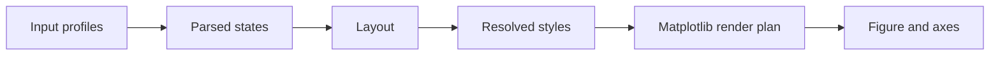

# Energy Profiles

`plot_energy_profile` draws reaction energy diagrams from simple Python data
structures. It can plot a single pathway, overlay related pathways, and show
side reactions.

```python
from frust.vis import plot_energy_profile
```

## Minimal Profile

```python
states = [
    ("Reactant", 0.0),
    ("TS1", 18.4),
    ("Intermediate", 4.2),
    ("TS2", 13.7),
    ("Product", -6.1),
]

fig, ax = plot_energy_profile(states)
```


## Overlay Profiles

Use a dictionary when comparing pathways. The first entry is the reference
profile used for x-axis layout.

```python
profiles = {
    "Path A": [
        ("Reactant", 0.0),
        ("TS1", 18.4),
        ("Product", -6.1),
    ],
    "Path B": [
        ("Reactant", 0.0),
        ("TS1", 14.9),
        ("Product", -8.3),
    ],
}

fig, ax = plot_energy_profile(
    profiles,
    overlay_alpha=1.0,
    overlay_colors={"Path B": "tab:green"},
)
```


!!! tip "Recommended for overlays"

    Keep `show_state_labels=True` or leave it as the default for overlays. State
    names then appear on the x-axis and point annotations stay compact.

## Side Reactions

Add a side reaction by inserting a `side-rxn` marker before the side-path
states.

```python
states = [
    ("Reactant", 0.0),
    ("TS1", 18.4),
    ("Intermediate", 4.2),
    "side-rxn@Intermediate@0.6#Side product",
    ("Side TS", 22.0),
    ("Product", -6.1),
    ("Side product", -3.0),
]

fig, ax = plot_energy_profile(states)
```


The marker format is:

```text
side-rxn@anchor_label@rise_fraction#Legend label
```

- `anchor_label` is the state where the side connector begins.
- `rise_fraction` controls how much of the connector is flat before it bends.
- `Legend label` is optional and appears in the legend.

!!! warning "Side-reaction ownership"

    Entries after `side-rxn` are treated as the side pathway, except for the
    main product point that is pulled back into the main pathway. Label colors
    follow the resolved pathway ownership, not just raw input order.

## Label Placement

The optional third tuple item controls label placement:

```python
("TS1", 18.4, "t")      # top
("int1", 4.2, "bb")     # farther below
("Product", -6.1, "tr") # top-right with arrow
```

Accepted short tokens are `t`, `b`, `l`, and `r`.

## Rendering Pipeline



!!! example "Color one overlay"

    ```python
    plot_energy_profile(
        profiles,
        overlay_colors={"Path B": ("tab:green", "tab:olive")},
    )
    ```

    A two-item color tuple sets `(main_path_color, side_path_color)`.
    The rendered output follows the same overlay style shown above, with the
    second tuple color used for any side-reaction branch.
