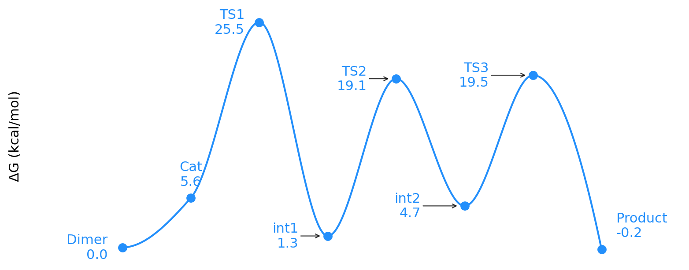
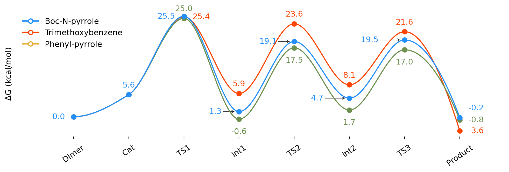
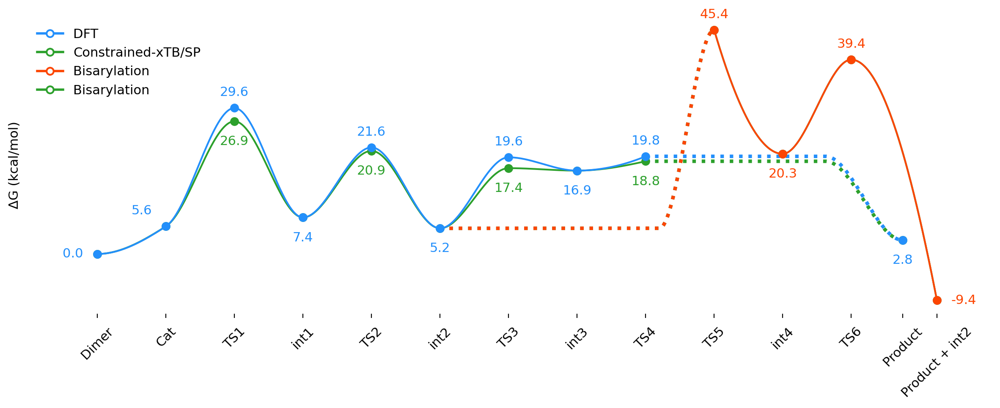

# Energy Profiles

`plot_energy_profile` turns a list of reaction states into a reaction-coordinate
diagram.

```python
from frust.vis import plot_energy_profile
```

The mental model is:

| Python input | Meaning in the plot |
| --- | --- |
| `("TS1", 25.5)` | State label and relative energy |
| `("TS1", 25.5, "l")` | Same state, with the label nudged left |
| `"side-rxn@int2@0.8#Bisarylation"` | Start a side pathway from `int2` |
| `{"DFT": states1, "xTB": states2}` | Overlay multiple profiles |

Energies are usually relative free energies in kcal/mol, but the plotting
function only requires consistent numeric values.

## From Data To States

In practice, the energies often start in a dataframe. Build the `states` list by
choosing the rows or columns that represent the reaction coordinate.

| step | state | dG |
| ---: | --- | ---: |
| 0 | Dimer | 0.0 |
| 1 | Cat | 5.6 |
| 2 | TS1 | 25.5 |
| 3 | int1 | 1.3 |
| 4 | TS2 | 19.1 |
| 5 | int2 | 4.7 |
| 6 | TS3 | 19.5 |
| 7 | Product | -0.2 |

```python
states = list(df_profile[["state", "dG"]].itertuples(index=False, name=None))

fig, ax = plot_energy_profile(states)
```

If a few labels need manual placement, add a placement column and keep only the
non-empty placements:

```python
states = [
    (row.state, row.dG, row.label_position)
    if row.label_position
    else (row.state, row.dG)
    for row in df_profile.itertuples()
]
```

## Plot One Profile

Start with the states you want to show:

| State | Energy |
| --- | ---: |
| Dimer | 0.0 |
| Cat | 5.6 |
| TS1 | 25.5 |
| int1 | 1.3 |
| TS2 | 19.1 |
| int2 | 4.7 |
| TS3 | 19.5 |
| Product | -0.2 |

Then pass the same states to `plot_energy_profile`:

```python
states = [
    ("Dimer", 0.0),
    ("Cat", 5.6),
    ("TS1", 25.5, "l"),
    ("int1", 1.3, "ll"),
    ("TS2", 19.1, "ll"),
    ("int2", 4.7, "lll"),
    ("TS3", 19.5, "lll"),
    ("Product", -0.2, "tr"),
]

fig, ax = plot_energy_profile(
    states,
    figsize=(8, 3.3),
    state_label_rotation=35,
)
```



The optional third tuple item controls label placement. Repeat a direction to
move the label farther.

| Token | Effect |
| --- | --- |
| `"t"` | place above |
| `"b"` | place below |
| `"l"` | nudge left |
| `"r"` | nudge right |
| `"tr"` | place above and nudge right |
| `"lll"` | nudge farther left |

## Overlay Related Profiles

Use a dictionary when comparing the same reaction stages for several substrates
or methods. The first profile sets the state order along the x-axis.

| Profile | Cat | TS1 | int1 | TS2 | int2 | TS3 | Product |
| --- | ---: | ---: | ---: | ---: | ---: | ---: | ---: |
| Boc-N-pyrrole | 5.6 | 25.5 | 1.3 | 19.1 | 4.7 | 19.5 | -0.2 |
| Trimethoxybenzene | 5.6 | 25.4 | 5.9 | 23.6 | 8.1 | 21.6 | -3.6 |
| Phenyl-pyrrole | 5.6 | 25.0 | -0.6 | 17.5 | 1.7 | 17.0 | -0.8 |

```python
profiles = {
    "Boc-N-pyrrole": [
        ("Dimer", 0.0),
        ("Cat", 5.6),
        ("TS1", 25.5, "l"),
        ("int1", 1.3, "ll"),
        ("TS2", 19.1, "ll"),
        ("int2", 4.7, "lll"),
        ("TS3", 19.5, "lll"),
        ("Product", -0.2, "tr"),
    ],
    "Trimethoxybenzene": [
        ("Dimer", 0.0),
        ("Cat", 5.6),
        ("TS1", 25.4, "r"),
        ("int1", 5.9, "t"),
        ("TS2", 23.6),
        ("int2", 8.1, "t"),
        ("TS3", 21.6),
        ("Product", -3.6, "r"),
    ],
    "Phenyl-pyrrole": [
        ("Dimer", 0.0),
        ("Cat", 5.6),
        ("TS1", 25.0),
        ("int1", -0.6),
        ("TS2", 17.5, "b"),
        ("int2", 1.7),
        ("TS3", 17.0, "b"),
        ("Product", -0.8, "r"),
    ],
}

fig, ax = plot_energy_profile(
    profiles,
    figsize=(10, 3.5),
    overlay_alpha=1.0,
    state_label_rotation=35,
)
```



!!! tip "Overlay profiles"

    Keep the state labels consistent between profiles. Matching labels let FRUST
    place related states at the same x-position, which makes the comparison
    easier to read.

!!! warning "Overlay labels must match"

    In overlay mode, labels in later profiles are aligned to the first profile.
    If an overlay profile contains a new non-product label that is not present in
    the first profile, FRUST raises an error. Add the state to the first profile,
    rename the labels consistently, or use `overlay="off"` if the pathways should
    be laid out independently.

## Add A Side Reaction

Insert a `side-rxn` marker at the point where a side pathway branches away from
the main profile.

| Entry | Meaning |
| --- | --- |
| `side-rxn` | Start side-path parsing |
| `int2` | Branch from the state named `int2` |
| `0.8` | Keep 80% of the connector flat before bending |
| `Bisarylation` | Label the side pathway in the legend |

```text
side-rxn@int2@0.8#Bisarylation
```

Here the main profile is compared with a constrained-xTB single-point profile.
Both profiles include the same bisarylation side pathway.

```python
profiles = {
    "DFT": [
        ("Dimer", 0.0),
        ("Cat", 5.6, "tl"),
        ("TS1", 29.6),
        ("int1", 7.4),
        ("TS2", 21.6),
        ("int2", 5.2),
        ("TS3", 19.6),
        ("int3", 16.9),
        ("TS4", 19.8),
        "side-rxn@int2@0.8#Bisarylation",
        ("TS5", 45.4),
        ("int4", 20.3),
        ("TS6", 39.4),
        ("Product", 2.8, "b"),
        ("Product + int2", -9.4),
    ],
    "Constrained-xTB/SP": [
        ("Dimer", 0.0),
        ("Cat", 5.6, "tl"),
        ("TS1", 26.9, "b"),
        ("int1", 7.4),
        ("TS2", 20.9, "b"),
        ("int2", 5.2),
        ("TS3", 17.4, "b"),
        ("int3", 16.9),
        ("TS4", 18.8, "b"),
        "side-rxn@int2@0.8#Bisarylation",
        ("TS5", 45.4),
        ("int4", 20.3),
        ("TS6", 39.4),
        ("Product", 2.8, "b"),
        ("Product + int2", -9.4),
    ],
}

fig, ax = plot_energy_profile(
    profiles,
    figsize=(12, 5),
    main_to_product_drop_frac=0.7,
    product_x_offset=0.5,
    same_energy_mode="hide",
    state_label_rotation=45,
    overlay_alpha=1.0,
    overlay_colors={"Constrained-xTB/SP": "tab:green"},
)
```



!!! warning "Side-path ownership"

    Entries after a `side-rxn` marker belong to the side pathway, except for
    product-like states that FRUST pulls back into the main pathway. Keep labels
    unique enough that the branch point and product states are unambiguous.

## Product Labels

FRUST treats labels starting with `Product` as product-like states. This matters
when a profile contains more than one product endpoint.

```python
states = [
    ("Dimer", 0.0),
    ("Cat", 5.6),
    ("TS1", 29.6),
    ("int2", 5.2),
    "side-rxn@int2@0.8#Bisarylation",
    ("TS5", 45.4),
    ("Product", 2.8),
    ("Product + int2", -9.4),
]
```

`Product` and `Product + int2` are drawn close to each other near the end of the
profile. Increase `product_x_offset` when the labels or energy annotations
overlap.

## Common Options

| Option | Use when you want to |
| --- | --- |
| `figsize=(12, 5)` | control the figure shape |
| `overlay_alpha=1.0` | make overlay profiles fully opaque |
| `overlay_colors={...}` | set colors for specific profiles |
| `state_label_rotation=45` | rotate crowded x-axis labels |
| `same_energy_mode="hide"` | hide duplicate energy annotations in overlays |
| `product_x_offset=0.5` | separate multiple product-like states |
| `font_size=14` | scale labels, energies, and legend together |
| `hide_y_ticks=False` | show the numeric y-axis |
| `grid=True` | add a background grid |
| `ylabel="ΔE (kcal/mol)"` | change the axis label |
| `decimals=2` | show more energy precision |
| `annotate_energies=False` | show state labels without energy values in a single profile |

For example, a two-color overlay entry sets the main-path and side-path colors:

```python
plot_energy_profile(
    profiles,
    overlay_colors={"Constrained-xTB/SP": ("tab:green", "tab:olive")},
)
```

Because `plot_energy_profile` returns Matplotlib objects, save or customize the
figure in the usual way:

```python
fig, ax = plot_energy_profile(
    profiles,
    figsize=(12, 5),
    hide_y_ticks=False,
    grid=True,
)

ax.set_title("Relative reaction energies")
fig.savefig("energy-profile.png", dpi=300, bbox_inches="tight")
```
