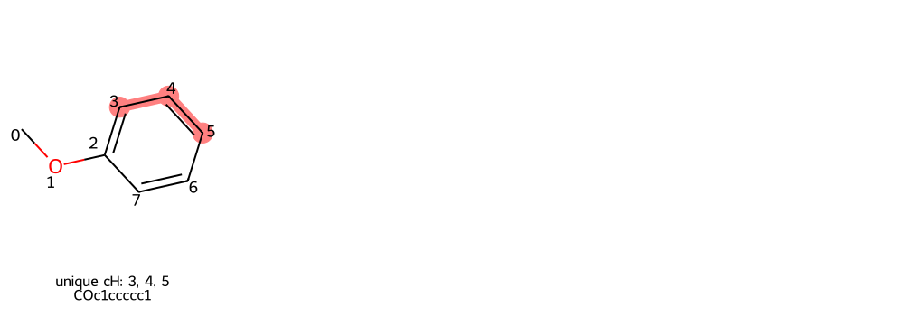
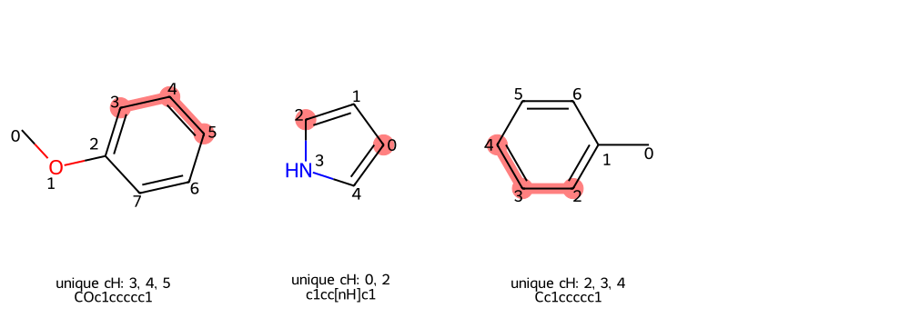
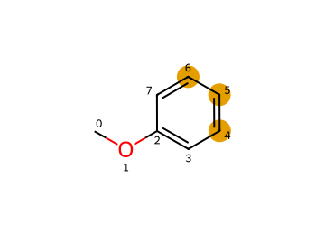

# Molecular Grids

Use molecular grid helpers when you already have molecules, coordinate files, or
reaction objects and want a quick notebook visualization.

!!! tip "Works without a FRUST workflow"

    `MolTo3DGrid`, `RxnTo3DGrid`, and `DrawMolSvg` are available from
    `frust.vis` so notebooks can use one visualization import path.

## 3D Molecule Grids

`MolTo3DGrid` accepts RDKit molecules, SMILES strings, `.xyz` paths, or mixed
lists of those inputs. It renders an interactive py3Dmol grid.

```python
from frust.vis import MolTo3DGrid

MolTo3DGrid(
    ["CCO", "CC(=O)O", "c1ccccc1"],
    legends=["ethanol", "acetic acid", "benzene"],
    highlightAtoms=[[1], [1, 2], [0, 1, 2, 3, 4, 5]],
    show_labels=True,
    show_charges=True,
    cell_size=(320, 320),
    columns=3,
    linked=True,
)
```

<iframe
  src="../../assets/molto3dgrid-example.html"
  title="MolTo3DGrid example with labels and highlighted atoms"
  width="100%"
  height="390"
  loading="lazy"
  style="border: 1px solid var(--md-default-fg-color--lightest); border-radius: 6px;"
></iframe>

!!! tip "Interactive inspection"

    In the exported viewer, click atoms to toggle labels. Ctrl-click two atoms
    to measure a distance, and Shift-click three atoms to measure an angle.

!!! example "Export a reusable HTML viewer"

    ```python
    MolTo3DGrid(
        ["reactant.xyz", "transition_state.xyz", "product.xyz"],
        legends=["Reactant", "TS", "Product"],
        export_HTML="docs/assets/reaction-snapshot.html",
    )
    ```

    The exported file can be embedded with the same iframe pattern used above.

Common options include:

| Option | Use |
| --- | --- |
| `legends` | Add a label to each viewer cell |
| `highlightAtoms` | Highlight atoms in each molecule |
| `show_labels` | Draw atom labels before rendering |
| `show_charges` | Show formal charges as annotations |
| `show_confs` | Show all conformers instead of only one |
| `bonds_to_remove` | Hide selected bonds before rendering |
| `linked` | Rotate and zoom all cells together |
| `export_HTML` | Write the interactive viewer to an HTML file |

## Reaction Grids

`RxnTo3DGrid` renders a reaction as reactants, an arrow cell, and products. It
accepts an RDKit reaction object or a reaction SMILES/SMARTS string.

```python
from frust.vis import RxnTo3DGrid

RxnTo3DGrid(
    "CCO>>CC=O",
    legends=["ethanol", "acetaldehyde"],
    show_labels=True,
    show_charges=True,
    cell_size=(320, 320),
    linked=True,
)
```

<iframe
  src="../../assets/rxnto3dgrid-example.html"
  title="RxnTo3DGrid example with reactant and product cells"
  width="100%"
  height="390"
  loading="lazy"
  style="border: 1px solid var(--md-default-fg-color--lightest); border-radius: 6px;"
></iframe>

!!! example "Show mapped reaction changes"

    If the reaction is atom-mapped, `RxnTo3DGrid` can highlight changed bonds
    and charges:

    ```python
    RxnTo3DGrid(
        mapped_reaction,
        show_bond_changes=True,
        show_charge_changes=True,
        check_reaction_stoichiometry=True,
    )
    ```

    Output is the same three-cell reaction viewer, with colored annotations for
    the mapped bond and charge changes.

Useful reaction options include:

| Option | Use |
| --- | --- |
| `show_bond_changes` | Highlight formed, broken, or changed-order bonds |
| `show_charge_changes` | Highlight atoms with changed formal charge |
| `h_mode` | Control hydrogen display around reactive atoms |
| `check_reaction_stoichiometry` | Warn when mapped atoms are not balanced |
| `linked` | Rotate and zoom the reaction cells together |
| `export_HTML` | Write the interactive reaction viewer to HTML |

## Unique Aromatic C-H Positions

`DrawUniqueChGrid` highlights symmetry-unique aromatic C-H positions. This is
useful before selecting reactive positions for substrate-scope runs.

!!! example "Highlight unique positions from SMILES"

    ```python
    from frust.vis import DrawUniqueChGrid

    DrawUniqueChGrid("COc1ccccc1")
    ```

    

!!! example "Highlight positions from a DataFrame"

    ```python
    from frust.vis import DrawUniqueChGrid

    DrawUniqueChGrid(df, smiles_col="smiles")
    ```

    

## 2D Molecule SVGs

`DrawMolSvg` is useful when a static 2D depiction is clearer than an
interactive 3D viewer. It can highlight atoms, draw atom indices, dim the rest
of the molecule, and return SVG for reports or notebooks.

```python
from frust.vis import DrawMolSvg

DrawMolSvg(
    "COc1ccccc1",
    add_atom_indices=True,
    highlight_atom_indices=[4, 5, 6],
    highlight_as_circles=True,
)
```


