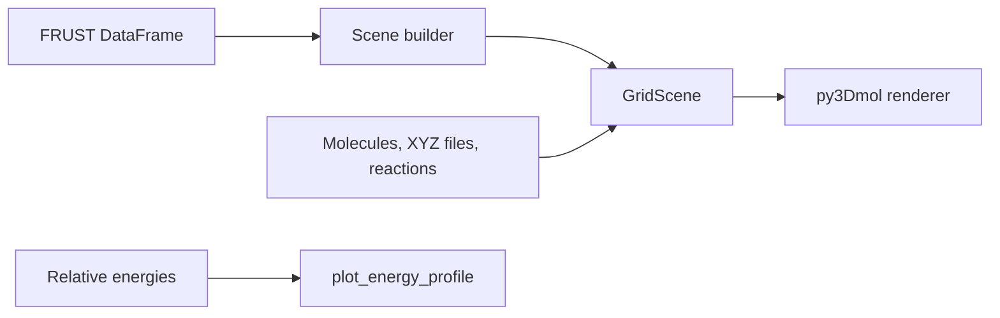

# Visualization

FRUST visualization helpers live under `frust.vis`. They are useful in two
different ways:

- inspect DataFrames generated by FRUST workflows;
- use FRUST as a general molecular visualization utility in notebooks.

!!! tip "Same import path, broader structure"

    The public import path is still `frust.vis`, but the implementation is
    organized around a shared scene renderer. FRUST converts DataFrame rows
    into a generic 3D scene, then renders that scene with py3Dmol.

## Common Imports

```python
from frust.vis import (
    MolTo3DGrid,
    RxnTo3DGrid,
    plot_mols,
    plot_vibs,
    plot_energy_profile,
)
```

## Choosing A Helper

| Task | Helper |
| --- | --- |
| Show molecules from FRUST rows | `plot_mols`, `plot_row`, `plot_lig`, `plot_rpos` |
| Show arbitrary molecules or XYZ files | `MolTo3DGrid` |
| Show reaction drawings | `RxnTo3DGrid` |
| Inspect imaginary modes | `plot_vibs` |
| Plot reaction energy profiles | `plot_energy_profile` |
| Highlight unique aromatic C-H positions | `DrawUniqueChGrid` |



The scene layer is mostly invisible in normal notebooks:

```python
import frust as ft

ft.plot_mols(df, row_indices=range(4))
ft.plot_vibs(df, row_indices=range(4), vId=0, columns=2)
```

For custom comparison views, you can build a scene explicitly and render it:

```python
scene = ft.vis.vibration_scene_from_dataframe(
    df,
    row_indices=range(4),
    vId=0,
    columns=2,
)

ft.vis.show_scene(scene)
```

!!! example "Use FRUST only for visualization"

    You do not need to run a full FRUST workflow to use the molecular viewers:

    ```python
    from frust.vis import MolTo3DGrid

    MolTo3DGrid(["reactant.xyz", "product.xyz"], legends=["Reactant", "Product"])
    ```

    Example output from the same interactive viewer family:

    <iframe
      src="../../assets/molto3dgrid-example.html"
      title="MolTo3DGrid overview example"
      width="100%"
      height="390"
      loading="lazy"
      style="border: 1px solid var(--md-default-fg-color--lightest); border-radius: 6px;"
    ></iframe>
