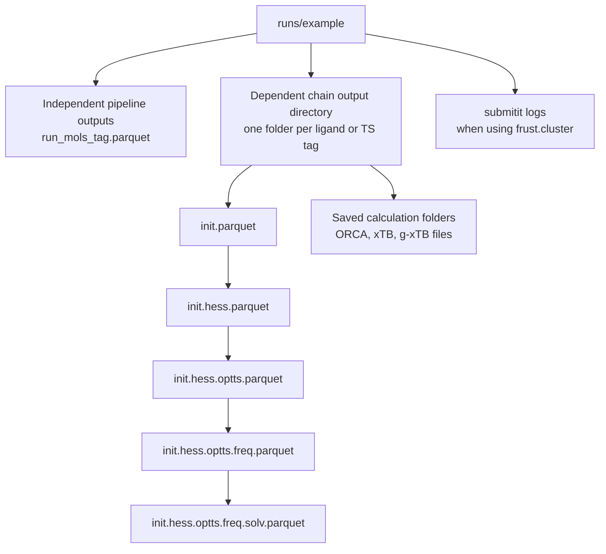

# Directory And Outputs

FRUST writes ordinary parquet files for tables and optional calculation
directories for backend files. The exact layout depends on whether you run a
local pipeline, independent cluster jobs, or a dependent stage chain.



## Independent Pipeline Outputs

For `submit_jobs(...)`, FRUST builds parquet names from the pipeline name and
job tag:

```text
<out_dir>/<pipeline>_<tag>.parquet
```

For example:

```text
runs/mols_example/run_mols_example.parquet
runs/ts_per_rpos_example/run_ts_per_rpos_anisole_rpos_2.parquet
```

The tag is sanitized so it is safe for file names and scheduler job names.

## Dependent Chain Outputs

For `submit_chain(...)`, each generated input gets its own save directory:

```text
runs/ts_chain_example/<tag>/
```

Inside that directory, the staged TS chain evolves the parquet filename:

```text
init.parquet
init.hess.parquet
init.hess.optts.parquet
init.hess.optts.freq.parquet
init.hess.optts.freq.solv.parquet
```

!!! tip "Read the deepest parquet first"

    The deepest suffix usually contains the most complete dataframe. If
    `run_cleanup` was used, earlier parquet files may have been removed.

## Saved Calculation Files

When `save_step=True` or `save_output_dir=True`, FRUST keeps backend files that
are useful for debugging. Depending on the engine and options, saved folders
can include ORCA input/output files, xTB logs, optimized XYZ files, Hessians,
charges, and other backend artifacts.

!!! example "When to keep saved files"

    Use saved calculation directories when:

    - a row has `*-NT=False` and `*-error` is not enough;
    - an ORCA job converged to the wrong stationary point;
    - you need to inspect an xTB or g-xTB optimized geometry outside FRUST;
    - you want to archive the exact backend inputs used for a final result.

## Merging Parquet Files

Large submitit runs may produce many parquet files. Use the packaged command to
merge them:

```bash
merge_parquet --input-dir runs/example --output merged.parquet --recursive
```

Then inspect the merged table with pandas:

```python
import pandas as pd

df = pd.read_parquet("merged.parquet")
```
