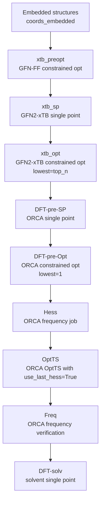

# Optimization Pipeline

FRUST calculation stages are chained through a dataframe. Each stage reads the
latest available coordinate column, runs a backend calculation, and adds
stage-prefixed output columns such as `xtb_opt-NT`, `xtb_opt-EE`, and
`xtb_opt-oc`.



This diagram matches the staged `ts_per_rpos` chain in
`frust.pipelines.run_ts_per_rpos`. The high-level pipeline functions use the
same idea, but hide more of the orchestration.

!!! tip "Cheap broad, expensive narrow"

    The normal screening pattern is to generate many conformers, optimize them
    cheaply, keep only the lowest few, and then spend DFT time on the best
    candidates.

## Stepper Pattern

At the `Stepper` layer, the pipeline is explicit:

```python
df = step.xtb(
    df,
    name="xtb_opt",
    options={"gfn": 2, "opt": None},
    constraint=True,
    lowest=5,
)

df = step.orca(
    df,
    name="orca_sp",
    options={"r2scan-3c": None, "SP": None},
)
```

`Stepper` chooses the latest coordinate column automatically. For example, an
ORCA stage after `xtb_opt` will use `xtb_opt-oc` rather than the original
`coords_embedded`.

## TS Chain Stages

The dependent `ts_per_rpos` cluster chain writes a new parquet file after each
major stage:

| Stage | Main purpose | Output suffix |
| --- | --- | --- |
| `run_init` | embed, xTB cleanup, constrained DFT pre-optimization | `init.parquet` |
| `run_hess` | calculate an ORCA Hessian for the best rows | `.hess.parquet` |
| `run_OptTS` | run ORCA `OptTS` with `use_last_hess=True` | `.optts.parquet` |
| `run_freq` | verify the optimized stationary point | `.freq.parquet` |
| `run_solv` | run solvent single points | `.solv.parquet` |
| `run_cleanup` | remove intermediate parquet files | keeps deepest output |

!!! warning "Frequency method depends on the backend"

    Standard ORCA DFT frequency stages use `Freq`. ORCA-driven g-xTB uses an
    external-gradient route, so use `NumFreq` for finite-difference
    frequencies. See [g-xTB With FRUST](../external-tools/gxtb.md).

## When To Use g-xTB Or UMA

Use direct `Stepper.gxtb(...)` for ordinary g-xTB single points,
optimizations, gradients, or Hessians.

Use `Stepper.orca(..., gxtb=True)` when ORCA should own the optimizer, such as
`OptTS`, while g-xTB supplies external energies and gradients.

Use `Stepper.orca(..., uma=...)` for UMA-backed ORCA external calculations.
The same dataframe conventions still apply: inspect `*-NT`, `*-EE`, `*-oc`,
`*-vibs`, and `*-error` columns after each stage.
