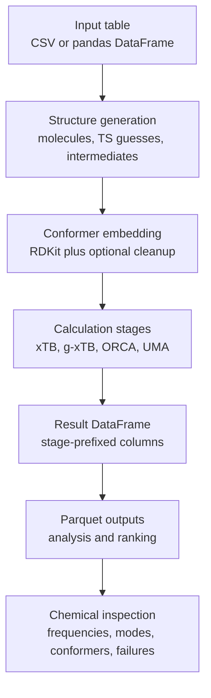
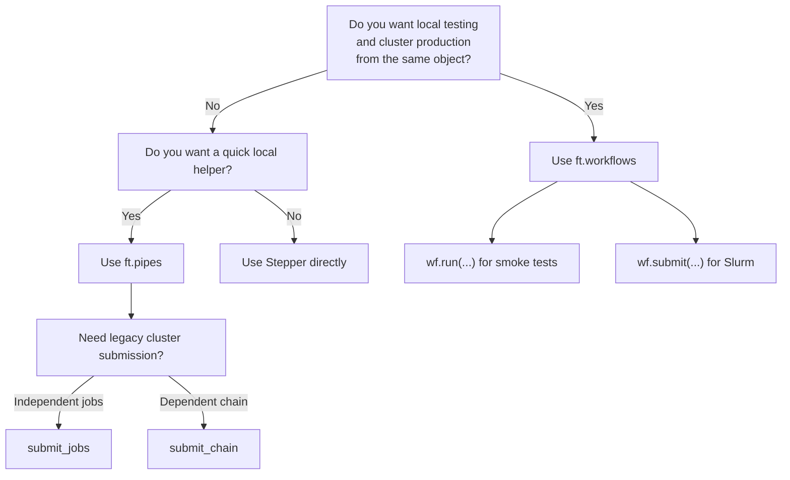

# Workflow Overview

FRUST workflows are easiest to understand as a pipeline from a small input
table to a results dataframe.

!!!info "Naming"

    **Ligand** and **substrate** are used interchangeably for historical reasons.

You usually start with ligand or substrate information, often a CSV or a pandas dataframe with a `smiles` column. FRUST turns those inputs into molecular structures, embeds conformers, runs calculation stages, filters or ranks the results, and writes parquet files that can be inspected later.

For example, the input might be as small as:

```python
import pandas as pd

ligands = pd.DataFrame({"smiles": ["c1ccccc1", "COc1ccccc1"]})
```

The details can get technical, but the mental model is simple:



!!! tip "Recommended reading order"

    Start with this overview, then read
    [Workflow Method Plans](workflow-methods.md),
    [Catalyst Screen Workflow](../catalyst-screens/overview.md),
    [TS Guess Generation](ts-guess-generation.md) and
    [Optimization Pipeline](optimization-pipeline.md) before launching a large
    TS screen.

## The Four Layers

FRUST has four workflow layers. Most users move from top to bottom only when
they need more control.

### 1. Workflow Objects

Use `ft.workflows` for new production work where the same setup should be
tested locally and then submitted to a cluster.

```python
import frust as ft

method = ft.workflows.methods.preset("r2scan-3c")

wf = ft.workflows.screen_ts(
    csv_path="screen.csv",
    ts_types=["TS1", "TS2", "TS3", "TS4"],
    method=method,
    n_confs=None,
    top_n=10,
    dft=True,
)

df = wf.run(targets=[0], out_dir="debug/screen_ts", execution="dft_staged")
```

The same object can then be submitted:

```python
result = wf.submit(
    out_dir="runs/screen_ts",
    cluster=cluster,
    execution="dft_staged",
)
```

By default, `wf.submit(...)` also submits a final collector job. When the jobs
finish, the run directory contains `merged.parquet` and
`collection_report.json`.

This layer keeps three decisions separate:

| Decision | Example |
| --- | --- |
| chemistry and targets | `ft.workflows.screen_ts(...)` |
| calculator choices | `ft.workflows.methods.preset("r2scan-3c")` |
| local or cluster execution | `wf.run(...)` or `wf.submit(...)` |

For an input where each SMILES is already the exact molecule to calculate, use
`raw_mols`:

```csv
compound_name,smiles
piperidine_dimer,C1(N2CCCCC2)=CC=CC=C1[BH-]3[H+][BH-]([H+]3)C4=CC=CC=C4N5CCCCC5
diethylamino_dimer,CCN(CC)C1=CC=CC=C1[BH-]2[H+][BH-]([H+]2)C3=CC=CC=C3N(CC)CC
dimethylamino_dimer,CN(C)C1=CC=CC=C1[BH-]2[H+][BH-]([H+]2)C3=CC=CC=C3N(C)C
```

```python
import frust as ft
from frust import ClusterConfig, Resources

cluster = ClusterConfig(
    backend="slurm",
    partition="kemi1",
    log_dir="logs/raw_dimers_r2scan3c",
)

wf = ft.workflows.raw_mols(
    csv_path="raw_dimers.csv",
    method="r2scan-3c",
    n_confs=None,
    top_n=10,
    dft=True,
)
```

Inspect the active stages before choosing cluster resources:

```python
wf.show_stages()[["group", "stage", "engine", "options"]]
```

| group | stage | engine | options |
| --- | --- | --- | --- |
| `init` | `prepare` | `prepare` |  |
| `init` | `xtb_preopt` | `xtb` | `gfnff opt` |
| `init` | `xtb_sp` | `xtb` | `gfn=2` |
| `init` | `xtb_opt` | `xtb` | `gfn=2 opt` |
| `init` | `dft_pre_sp` | `orca` | `r2SCAN-3c TightSCF SP NoSym` |
| `dft_opt` | `dft_opt` | `orca` | `r2SCAN-3c TightSCF SlowConv Opt NoSym` |
| `freq` | `freq` | `orca` | `r2SCAN-3c TightSCF SlowConv Freq NoSym` |
| `solv` | `solv` | `orca` | `r2SCAN-3c TightSCF SP NoSym` |

```python
result = wf.submit(
    out_dir="runs/raw_dimers_r2scan3c",
    cluster=cluster,
    execution="dft_staged",
    stage_resources={
        "init": Resources(cpus=24, mem_gb=20, timeout_min=7200),
        "dft_opt": Resources(cpus=24, mem_gb=20, timeout_min=7200),
        "freq": Resources(cpus=8, mem_gb=64, timeout_min=7200),
        "solv": Resources(cpus=24, mem_gb=20, timeout_min=3600),
    },
)
```

The automatic collector writes the merged normal-termination output to
`runs/raw_dimers_r2scan3c/merged.parquet` and lists skipped or missing targets
in `runs/raw_dimers_r2scan3c/collection_report.json`.

!!! note "Raw molecules versus generated molecule states"

    Use `ft.workflows.raw_mols(...)` when the `smiles` value is the molecule to
    calculate. Use `ft.workflows.mols(..., select_mols=...)` when FRUST should
    generate catalytic-cycle structures such as `dimer`, `int2`, or `mol2`.
    A raw molecule DFT workflow uses `init`, `dft_opt`, `freq`, and `solv`
    resource groups; it does not run TS-only `hess` or `optts` stages.

See [Workflow Method Plans](workflow-methods.md) for the full pattern.

For the substrate/catalyst screen-specific input table, TS1-TS4 guess model,
row-level constraints, and production checklist, see
[Catalyst Screen Workflow](../catalyst-screens/overview.md).

### 2. High-Level Pipelines

Use `frust.pipes` when you want FRUST to do the usual structure generation and
calculation sequence for you in one local helper call.

These functions are the simplest entry points:

- `run_mols(...)`: start from molecule inputs and run the molecule workflow.
- `run_ts_per_lig(...)`: use one transition-state template for each ligand.
- `run_ts_per_rpos(...)`: expand a template over reactive positions and run
  each generated structure.

These are good when you are asking a direct screening question, such as “run
this standard workflow for this ligand table.”

Example:

```python
from frust.pipes import run_mols

df = run_mols(ligands, save_output_dir=False)
```

### 3. Stepper

Use `Stepper` when you want to control the calculation stages yourself.

`Stepper` builds or consumes the initial FRUST dataframe, then adds new columns
as each calculation stage finishes. For a quick molecule calculation, pass a
SMILES string directly:

```python
from frust.stepper import Stepper

step = Stepper(save_output_dir=False)
df = step.build_initial_df("CCO", name="ethanol")
df = step.gxtb(df, name="gxtb_opt", options={"opt": None})
```

For FRUST-generated molecule or transition-state structures, keep the structure
generation step explicit and let `build_initial_df` embed the raw structures:

```python
from frust.utils.mols import create_mol_per_rpos

mols = create_mol_per_rpos(ligands)
df = step.build_initial_df(mols, n_confs=2)
```

Typical `Stepper` calls look like:

```python
df = step.xtb(df, name="xtb_preopt", options={"gfnff": None, "opt": None})
df = step.gxtb(df, name="gxtb_opt", options={"opt": None})
df = step.orca(df, name="orca_sp", options={"r2scan-3c": None, "SP": None})
```

Use this layer when you want to inspect intermediate results, change engine
options, keep only the lowest conformers after a specific stage, or mix xTB,
g-xTB, ORCA, and UMA in a custom order.

### 4. Submitit Submission

Use `frust.cluster` when the workflow should be launched through `submitit`.

The Slurm backend is for real cluster runs. The local backend is mainly for
checking that the submission wiring works before sending jobs to Slurm.

There are three submission styles:

- `submit_jobs(...)`: submit independent jobs, usually one pipeline run per
  generated structure or input group.
- `submit_chain(...)`: submit a dependent chain where each stage waits for the
  previous stage to finish.
- workflow objects: call `wf.submit(...)` when you want the new method-plan
  workflow API to manage the target graph.

Example:

```python
from frust.cluster import ClusterConfig, Resources, submit_jobs

submit_jobs(
    csv_path="datasets/example.csv",
    pipeline="run_mols",
    out_dir="runs/example",
    cluster=ClusterConfig(backend="slurm", partition="kemi1"),
    resources=Resources(cpus=16, mem_gb=50, timeout_min=14400),
)
```

See [Cluster Submission](../cluster/submission.md) for the submitit interface.

## Choosing An Entry Point

If you are new, start here:



In practice, choose the smallest layer that answers your question:

- use `ft.workflows.screen_ts(...)` or `ft.workflows.mols(...)` when a run
  should move from local testing to cluster production with the same method
  plan;
- use `run_mols(...)` for ordinary molecule screening;
- use `run_ts_per_lig(...)` when one TS template should be applied to each
  ligand;
- use `run_ts_per_rpos(...)` when reactive positions should be expanded from a
  template;
- use `submit_jobs(...)` to run those high-level workflows through submitit;
- use `submit_chain(...)` for staged TS or INT workflows where each stage has
  its own resources.

## What Happens During A Run

A typical high-level run does the following:

1. Read or receive the input ligand table.
2. Build molecule or TS-like structures from templates and SMILES.
3. Embed one or more conformers.
4. Create an initial dataframe with atoms, coordinates, conformer ids, and
   structure metadata.
5. Run one or more calculation stages through `Stepper`.
6. Add stage-prefixed output columns to the dataframe.
7. Optionally keep the lowest-energy conformers per structure group.
8. Write parquet output for later analysis.

The high-level functions hide many details, but they still return ordinary
pandas dataframes. That is intentional: you can sort, filter, plot, merge, and
store results using standard pandas tools.

After a run, it is normal to do something like:

```python
df_ok = df[df["xtb_opt-NT"]]
df_ok.sort_values("xtb_opt-EE").head()
```

## External Methods

UMA and g-xTB are both used through the same `Stepper.orca(...)` idea: ORCA owns
the calculation workflow, and an external backend supplies energies and
gradients.

UMA example:

```python
df = step.orca(
    df,
    options={"ExtOpt": None, "Opt": None},
    uma="omol@uma-s-1p1",
)
```

Direct g-xTB through Tooltoad:

```python
df = step.gxtb(df, options={"opt": None})
```

ORCA-driven g-xTB, useful when ORCA should own an optimizer such as `OptTS`:

```python
df = step.orca(df, options={"OptTS": None}, gxtb=True)
```

Use direct `Stepper.gxtb(...)` for normal g-xTB calculations. Use
ORCA-driven g-xTB when you specifically want ORCA's optimizer, TS machinery, or
finite-difference `NumFreq` behavior around the external g-xTB gradients.

## What To Inspect First

After a run, start with:

- `*-NT` columns: whether each calculation stage terminated normally;
- `*-EE` columns: electronic energies for ranking and filtering;
- `*-oc` columns: optimized coordinates from optimization stages;
- `*-error` columns: row-level backend errors;
- `df.attrs["frust_steps"]`: metadata about the stages that produced the
  dataframe.

For more detail on column names and dataframe conventions, see
[DataFrames And Results](dataframes.md).

For the chemical checks to run before trusting a result, see
[Inspecting Results](inspecting-results.md).
