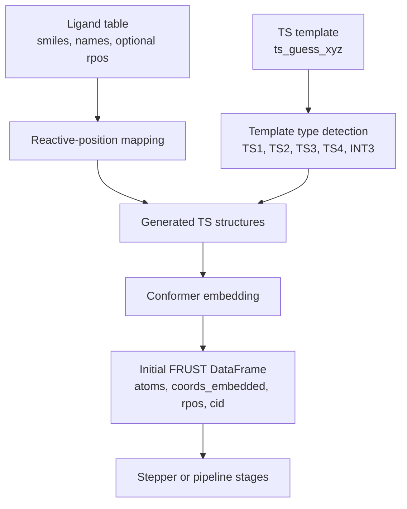

# TS Guess Generation

FRUST transition-state workflows start from two pieces of information:

- a ligand or substrate table, usually with a `smiles` column;
- a transition-state template geometry such as `structures/ts1.xyz` or
  `structures/ts2.xyz`.

!!! info "For the new catalyst/substrate screen workflow"

    Use [Catalyst Screen Workflow](../catalyst-screens/overview.md) when the
    input is a mixed substrate/catalyst table and FRUST should generate
    built-in `TS1`-`TS4` guesses from `frust.screen` and `frust.tsguess`.
    This page describes the older template-XYZ TS path.

The template tells FRUST what kind of TS-like structure to build. The ligand
table tells FRUST which substrates and reactive positions should be expanded.



!!! warning "Template geometry is chemical input"

    FRUST can generate and screen structures from a TS template, but it cannot
    prove that the template represents the intended reaction. Inspect the final
    imaginary mode before using a barrier.

## Choosing The TS Entry Point

Use `run_ts_per_lig(...)` when you want the normal in-process TS workflow from
a ligand table. Despite the name, this function expands each ligand over its
reactive positions internally with `create_ts_per_rpos(...)`, then runs the
resulting TS candidates sequentially in one workflow call.

```python
from frust.pipes import run_ts_per_lig

df = run_ts_per_lig(
    ligands,
    ts_guess_xyz="structures/ts1.xyz",
    n_confs=2,
    DFT=False,
)
```

Use `run_ts_per_rpos(...)` when TS structures have already been generated and
you want to run one pre-expanded reactive-position structure. This is mainly
useful for distribution: the cluster submission layer can split a CSV into
multiple `ts_struct` jobs and submit one job per generated reactive-position
structure.

```python
from frust.pipes import run_ts_per_rpos
from frust.utils.mols import create_ts_per_rpos

ts_structs = create_ts_per_rpos(
    ligands,
    ts_guess_xyz="structures/ts2.xyz",
    return_format="dict",
)

first_name = next(iter(ts_structs))
df = run_ts_per_rpos(
    {first_name: ts_structs[first_name]},
    n_confs=2,
    DFT=False,
)
```

!!! tip "Rule of thumb"

    Use `run_ts_per_lig(...)` for a local or single-process Python workflow.
    Use `run_ts_per_rpos(...)` when you deliberately want the reactive-position
    expansion step to happen before execution, usually so each generated
    structure can become a separate Slurm job.

!!! tip "Use fewer conformers for wiring checks"

    For a new template or CSV, start with `n_confs=1`, `DFT=False`, and a tiny
    input table. Once the structure generation and reactive-position mapping
    look correct, increase conformer coverage and launch the expensive stages.

## What The Initial DataFrame Contains

After embedding, FRUST builds a dataframe where each row is a generated
structure or conformer. The columns that matter first are:

| Column | Meaning |
| --- | --- |
| `substrate_name` | ligand or substrate identity |
| `structure_type` | TS or intermediate type, for example `TS1` or `INT3` |
| `rpos` | reactive position used for this generated structure |
| `cid` | conformer id |
| `atoms` | element symbols |
| `coords_embedded` | embedded starting coordinates |

!!! example "Check that reactive positions were generated"

    ```python
    df[["substrate_name", "structure_type", "rpos", "cid"]].head()
    df.groupby(["substrate_name", "rpos"], dropna=False).size()
    ```

## What To Inspect Before Running DFT

- Confirm each ligand generated the expected number of reactive-position rows.
- Confirm `rpos` points to the intended atom in the substrate.
- Inspect a few embedded structures before spending ORCA time.
- Check whether the lowest conformer after a cheap optimization is chemically
  sensible.

For the post-run checks, continue with
[Inspecting Results](inspecting-results.md).
